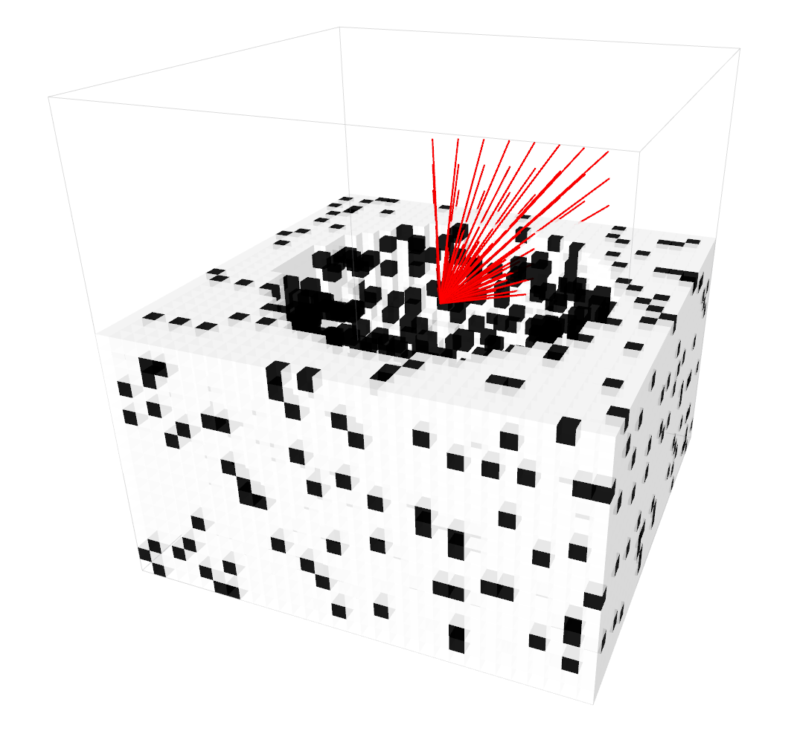
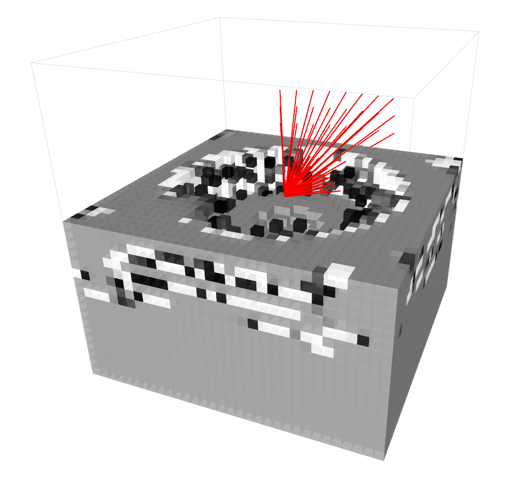

# Confidence Aware Occupancy Grid Mapping
ROS package implementing 3D mapping using octomap.

Evolution of error from SMAP and Log-Odds-based mapping over 500 iterations. The voxels of size 0.125 are aligned in a 32 x 32 x 32 occupancy grid.
SMAP is using a forward sensor model with std dev of 0.15.

 

True map (left) and estimated map generated by proposed method (right) after 2000 simulation steps in a fake 3D environment (32 x 32 x 32 voxel grid). The simulated depth camera has 8 x 6 pixel sensors spanning a horizontal field of view of 40 degrees (vertical FOV scaled accordingly to keep 1:1 pixel aspect ratio).
