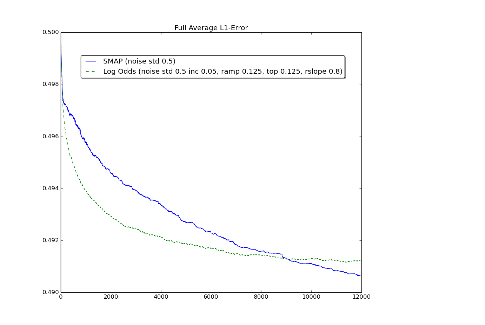
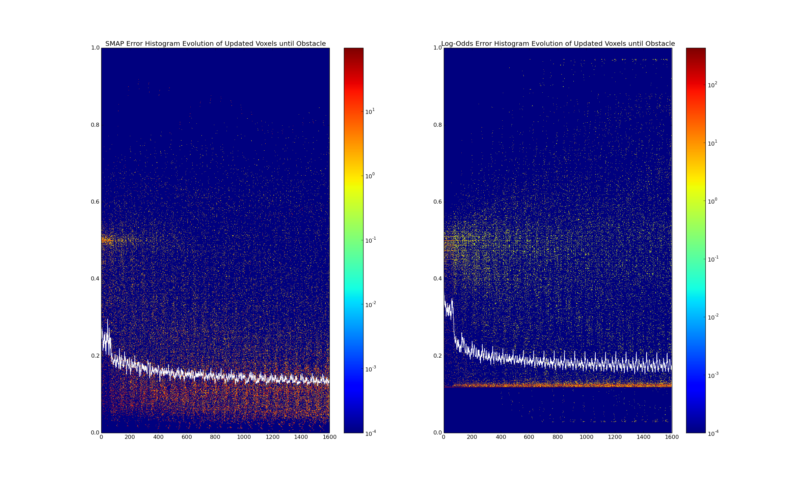
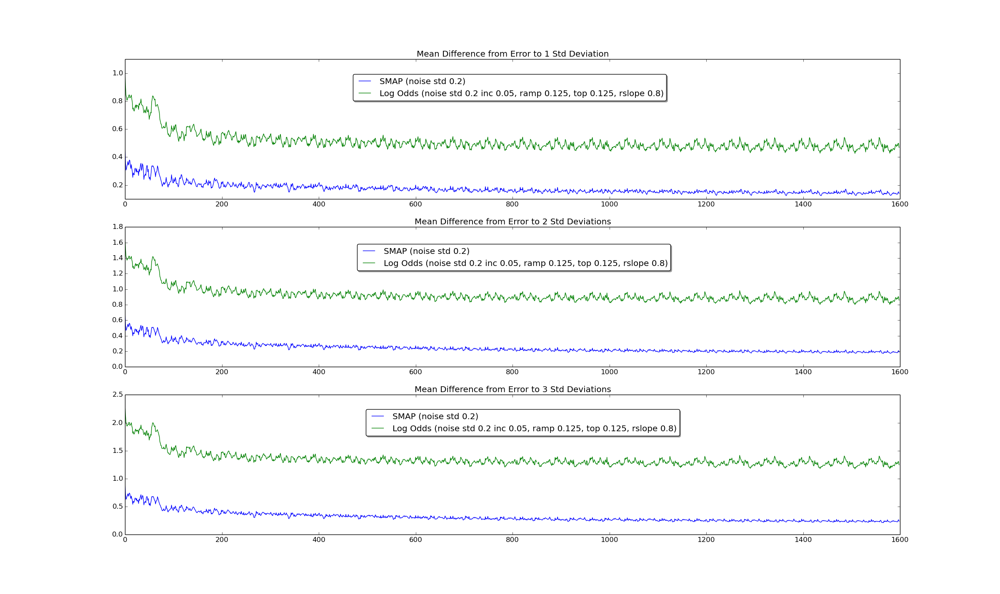
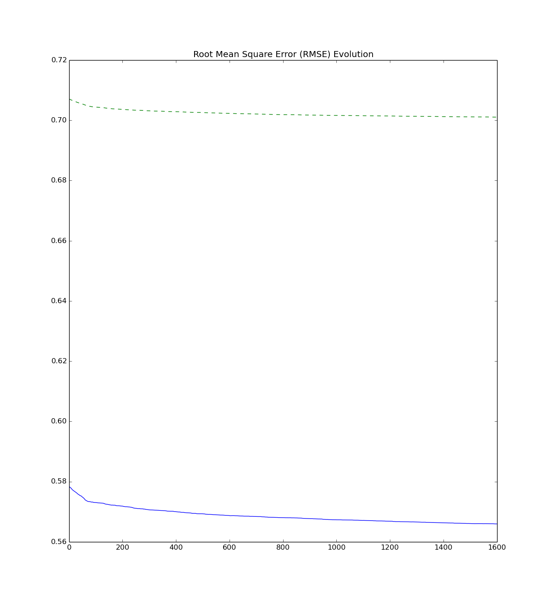
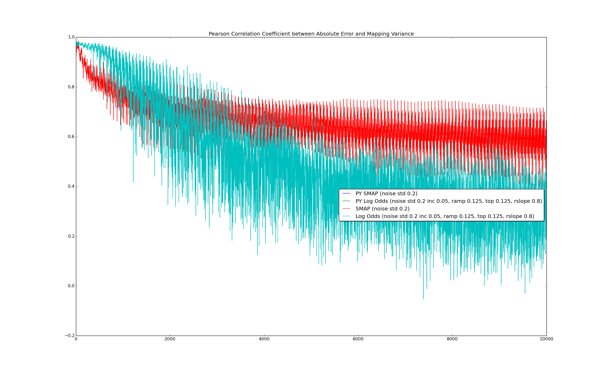
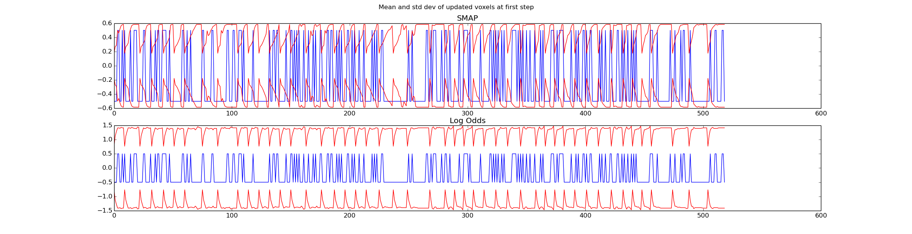
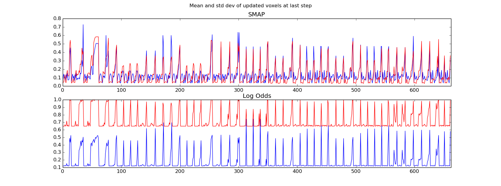
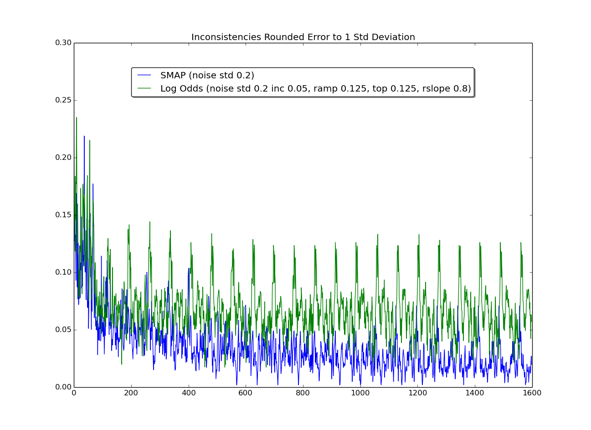

# SMAP Evaluation

This components is used for generating plots from the [smapStats](./msg/smapStats.msg) bag file
generated by [Statistics.cpp](./src/Statistics.cpp).

## Full Error (MAE) Evolution

Experiments with different observation noise std deviations compared to Log-Odds-based mapping:

Error evolution for the noise std deviations from the ICRA 2016 paper:

Even for very intensive noise levels like std=0.5 (voxel size is only 0.125),
SMAP ultimately converges and outperforms Log Odds:

## Distribution of Errors

To get better insights, how belief or Log Odds are updated at every step, in the following,
only the *updated* voxels are considered
that lie on the ray from the sensor position up until (and including) the first *occupied* voxel.

The following diagram visualizes the histogram of errors at every step.
1600 steps were executed which equates to 22.22 full rotations of the robot in the environment
(this explains periodic patterns in the plots).
The white line shows the average error of the updated voxels.
Note how Log Odds errors are clustered along a line at about 0.12.
After trying many different ISM parameters, it was not possible to improve Log Odds in the way that more errors
would be distributed below this cluster.

## Analysis of Mean and Variance

The following plot shows the average difference of 1, 2 and 3 standard deviations minus voxel mean.

Another error metric that takes into account mean and variance is the Root Mean Square Error (RMSE).
It is computed as 1/n * sqrt(μ² + σ²) for each voxel mean μ and std dev σ over n voxels.

### RMSE over all voxels:

### RMSE over only the updated voxels at every step:
_evolution_over_all_voxels.png
)

## Correlation between Error and Variance
The variance computed for each voxel should give insights into the confidence of the occupancy estimation.
The larger the variance, the greater is the expected error. The following plot shows the correlation between
SMAP's belief voxel Gaussian variance / Log Odds' Bernoulli variance, and the absolute error over all updated voxels
at each step.

The following plot shows error (blue) and +/- 2 std devs (red) for all _updated_ voxels at the first step of the simulation, inconsistencies (error > 2 std dev) are marked green:

The following plot shows error (blue) and +/- 2 std devs (red) for all _updated_ voxels at the last step of the simulation, inconsistencies (error > 2 std dev) are marked green:

I also tried to first round the error of each voxel before testing whether the deviation exceeds one standard deviation.
Since the rounded absolute error is either 0 or 1, the following plot is actually showing the evolution of cases where
the voxel was wrongly estimated to be free or occupied. It shows a similar curve to the error evolution from above.

