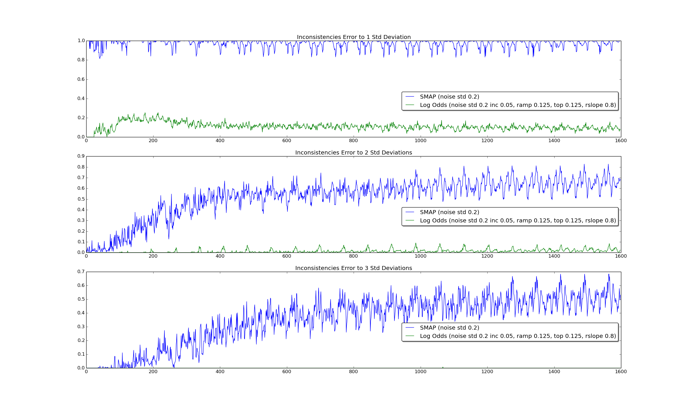
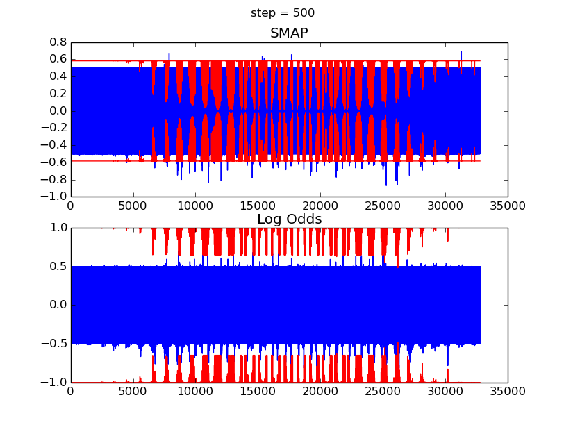

# SMAP Evaluation

This components is used for generating plots from the [smapStats](./msg/smapStats.msg) bag file
generated by [Statistics.cpp](./src/Statistics.cpp).

## Full Error (MAE) Evolution

Experiments with different observation noise std deviations compared to Log-Odds-based mapping:

Error evolution for the noise std deviations from the ICRA 2016 paper:

Even for very intensive noise levels like std=0.5 (voxel size is only 0.125),
SMAP ultimately converges and outperforms Log Odds:

## Distribution of Errors

To get better insights, how belief or Log Odds are updated at every step, in the following,
only the *updated* voxels are considered
that lie on the ray from the sensor position up until (and including) the first *occupied* voxel.

The following diagram visualizes the histogram of errors at every step.
1600 steps were executed which equates to 22.22 full rotations of the robot in the environment
(this explains periodic patterns in the plots).
The white line shows the average error of the updated voxels.
Note how Log Odds errors are clustered along a line at about 0.12.
After trying many different ISM parameters, it was not possible to improve Log Odds in the way that more errors
would be distributed below this cluster.

## Analysis of Mean and Variance

The following plot shows the average difference of 1, 2 and 3 standard deviations minus voxel mean.

Another error metric that takes into account mean and variance is the Root Mean Square Error (RMSE).
It is computed as 1/n * sqrt(μ² + σ²) for each voxel mean μ and std dev σ over n voxels.

### RMSE over all voxels:

### RMSE over only the updated voxels at every step:
_evolution_over_all_voxels.png
)

## Inconsistency

How many times (number of such voxels divided by total number of updated voxels)
was the error larger than 1, 2 and 3 standard deviations at every step?

_This looks really bad for SMAP._ Almost all computed means deviate by more than one std deviation from the true occupancy.
It must be noted that the belief variance fits much closer to the error as compared to the Bernoulli variance
used at Log Odds:
### Error mean and variance of all voxels at step 500

I also tried to first round the error of each voxel before testing whether the deviation exceeds one standard deviation:

